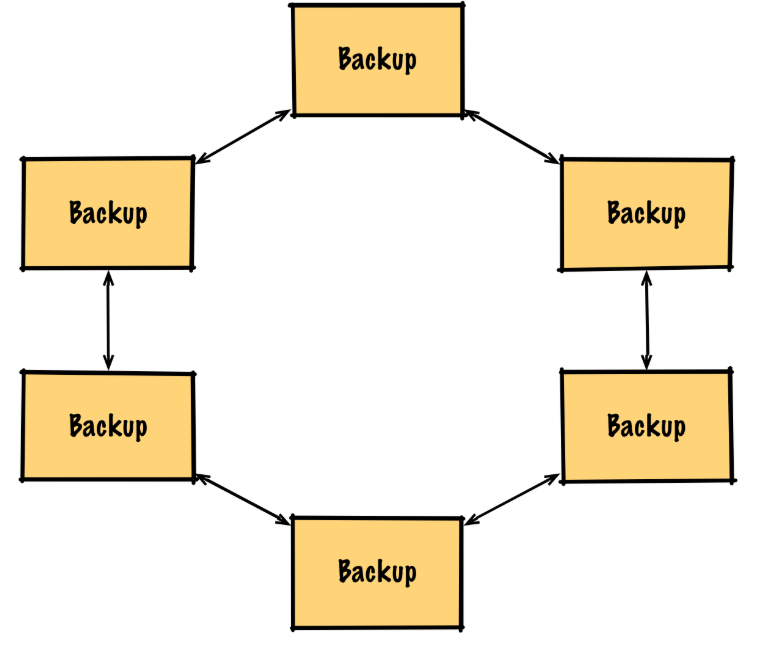
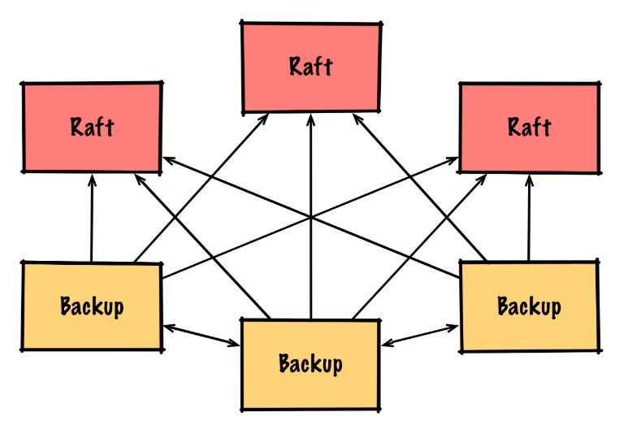
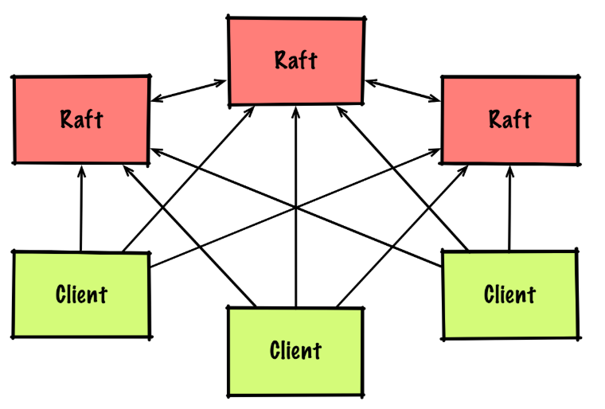
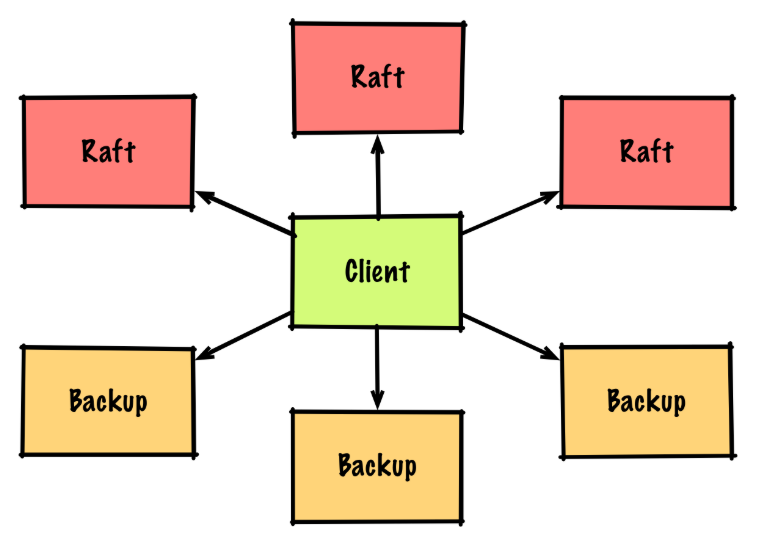
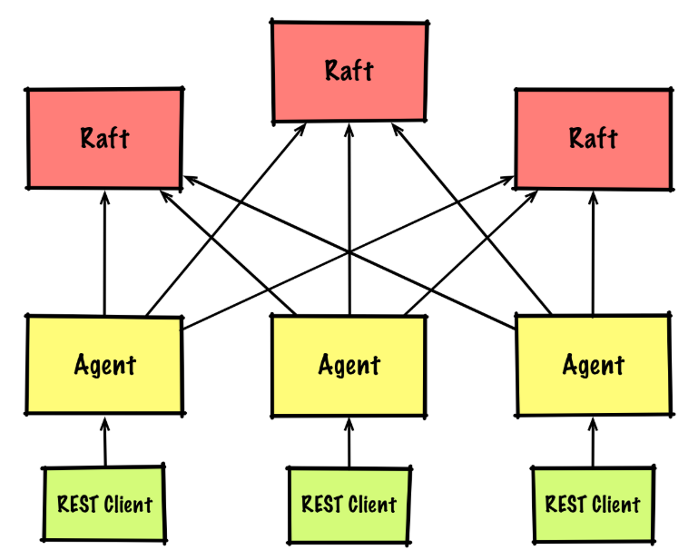
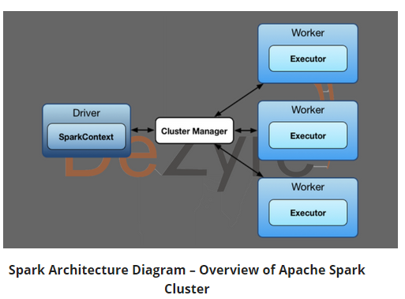

# SYT GEK103x Datamanagement "Distributed Data Structures" (MICT/BORM)

## Aufgabenbeschreibung

### Einführung

Komplexe und aufteilbare Tasks müssen mit Parametern ausgestattet werden und von entsprechenden Koordinatoren gestartet bzw. die erhaltenen Daten wieder zusammengefasst werden. Diese Art von verteilter Programmierung findet in vielen Anwendungsgebieten rege Verwendung (AI Daten Analyse, Lastverteilung, etc.). Hierbei kommt das Prinzip des Master/Worker Patterns (Master-Slave oder Map-Reduce Pattern) zum Einsatz.

### Ziele

Finden Sie eine Lösung, die in einer Cloud-Umgebung ausrollbar (deployable) ist. Die einzelnen Worker sollen unabhängig voneinander bestehen können und mit Input-Parametern gestartet werden. Die berechneten Daten müssen an den Master bzw. als Zwischenberechnung an andere Worker weitergegeben werden können. Die einzelnen Worker sollen unabhängig von der Umgebung gestartet werden können (unterschiedliche Servereinheiten).

### Voraussetzungen

- Grundverständnis von Python oder Java
- Lesen und Umsetzen von APIs
- Fähigkeit komplexe Programmier-Aufgaben zu implementieren und zu verteilen

### Detailierte Ausgabenbeschreibung

Recherchieren Sie mögliche Werkzeuge für das "distributed Computing". Vergleichen Sie mögliche Produkte in Bezug auf folgende Parameter:

- Architektur
- einsetzbare Programmiersprachen
- Datenverteilung und gemeinsamer Speicher
- Performance bei Main-Focus
- Notifikation von Master oder anderen Slaves

Nehmen Sie eine komplexe Aufgabenstellung/Berechnung und zeigen Sie anhand von einer Beispiel-Konfiguration, wie die Verteilung der Berechnung und anschließende Zusammenführung der Daten funktioniert. Bei ähnlichen oder gleichen Berechnungen wäre ein direkter Vergleich (Benchmark) der gewählten Tools/Technologien von Vorteil.

## Bewertung

Gruppengrösse: 1 Person

### Grundlegende Anforderungen **überwiegend erfüllt**

- Vergleich von Technologien

### Grundlegende Anforderungen **zur Gänze erfüllt**

- Einsatz eines Beispiels zur Veranschaulichung der Funktionsweise

### Erweiterte Anforderungen **überwiegend erfüllt**

- Einsatz einer zweiten Implementierung

### Erweiterte Anforderungen **zur Gänze erfüllt**

- Benchmark von zwei verschiedenen Technologien

## Quellen

- "A reactive Java framework for building fault-tolerant distributed systems" Atomix [github](https://github.com/atomix/atomix)
- "What is Atomix?" [atomix.io](https://atomix.io/docs/latest/user-manual/introduction/what-is-atomix/)
- "Introduction to Atomix" [baeldung](https://www.baeldung.com/atomix)
- "Primitive Protocols" [atomix.io](https://atomix.io/docs/latest/user-manual/primitives/primitive-protocols/)
- "The Raft Consensus Algorithm" [online](https://raft.github.io/)
- "In Search of an Understandable Consensus Algorithm" Raft-Paper; Stanford University; [online](https://raft.github.io/raft.pdf)
- "How to Create a distributed Datastore in 10 Minutes" Jonathan Halterman [online](https://jodah.net/create-a-distributed-datastore-in-10-minutes)
- "Spark Quickstart" [online](http://spark.apache.org/docs/latest/quick-start.html)
- "Spark Github repository with examples" [online](https://github.com/apache/spark)
- "Spark Tutorial: Real Time Cluster Computing Framework" [online](https://www.edureka.co/blog/spark-tutorial/)
- "Apache Spark Dockerimage" [online](https://github.com/gettyimages/docker-spark)
- "Open-source software for reliable, scalable, distributed computing" [Apache Hadoop](https://hadoop.apache.org/)
- "High-performance coordination service for distributed applications" [Apache Zookeeper](https://zookeeper.apache.org/doc/current/)
- "Distributed data store" [wikipedia](https://en.wikipedia.org/wiki/Distributed_data_store)
- "Understanding Hadoop v/s Spark v/s Storm" [cognixia.com](https://www.cognixia.com/blog/understanding-hadoop-vs-spark-vs-storm)
- "Comparison Storm and Spark" [whizlabs.com](https://www.whizlabs.com/blog/apache-storm-vs-apache-spark/)
- "etcd - A distributed, reliable key-value store" [online](https://etcd.io/)

---

---

## Vergleich von Technologien

### Atomix

Atomix ist ein Werkzeug um häufige distributed systems Probleme auf verschiedene Arten lösen zu können. Hierbei ist Atomix die Art des Problemes komplett gleichgültig, es stellt einfach `primitives` (Distributed data structures, Distributed communication, Distributed coordination, Group Membership) zur Lösung dieser Probleme zur Verfügung.

#### Architektur

##### Data-Grid

Die häufigste Architektur in Atomix ist ein Simples Data-Grid



Diese Architektur erlaubt das einfache replizieren von `primitives` auf allen konfigurierten Nodes im Cluster. Dadurch, dass man auch jederzeit Nodes hinzufügen kann und diese dynamisch von den anderen Nodes gefunden werden können, ist diese Architektur flexibel, effizient und skalierbar. Hier ist eine Beispiel Dokumentation aus der Atomix Dokumentation

```python
# The cluster configuration defines how nodes discover and communicate with one another
cluster {
  multicast.enabled: true   # Enable multicast discovery
  discovery.type: multicast # Configure the cluster membership to use multicast
}

# The management group coordinates higher level partition groups and is required
managementGroup {
  type: primary-backup # Use the primary-backup protocol
  partitions: 1        # Use only a single partition for system management
}

# Partition groups are collections of partitions in which primitives are replicated
# This sets up a partition group named `data` on this node
partitionGroups.data {
  type: primary-backup # Use the primary-backup protocol
  partitions: 71       # Use 71 partitions for scalability
  memberGroupStrategy: RACK_AWARE # Replicate partitions across physical racks
}
```

Diese Architektur erlaubt das erstellen von `primitives ` die auf allen Nodes im Cluster repliziert werden. Hier ist eine Beispiel in Java, in dem mittels `MultiPrimaryProtocol` genau das umgesetzt wird.

```java
Map<String, String> map = atomix.mapBuilder("my-map")
  .withProtocol(MultiPrimaryProtocol.builder()
    .withNumBackups(2)
    .build())
  .build();

map.put("foo", "bar");
```

Der größte Nachteil dieser Architektur ist ihre Inkonsistenz in Applikationen die Netzwerkkomponenten verwenden. Weiters kann es zu "split brain" kommen, durch die Tatsache, dass die Knoten nur einfach miteinander vernetzt sind.

##### Consistent Data-Grid

Diese Form des Data-Grid wurde entwickelt und Datenverlust und Inkonsistenz zwischen Netzwerkpartitionen zu vermeiden.



Atomix verwendet eine komplexe Implementierung des [Raft consensus algorithm](https://raft.github.io/), was kurz gesagt ein Algorithmus ist der für Konsistenz zwischen mehreren Servern sorgt, indem er sie bei Veränderungen zu einem Konsens zwingt den alle eintragen. In Atomix müssen hierfür erstmals einige Nodes in die "Raft management-group" konfiguriert werden.

```python
# The cluster configuration defines how nodes discover and communicate with one another
cluster {
  node {
    id: ${atomix.node.id}   # Should be one of management-group.members
    address: ${atomix.node.address}
  }
  multicast.enabled: true   # Enable multicast discovery
  discovery.type: multicast # Configure the cluster membership to use multicast
}

# The management group coordinates higher level partition groups and is required
# This node configures only a management group and no partition groups since it's
# used only for partition/primitive management
managementGroup {
  type: raft # Use the Raft consensus protocol for system management
  partitions: 1 # Use only a single partition
  members: [raft-1, raft-2, raft-3] # Raft requires a static membership list
}
```

Die Management Group koordiniert den Cluster in Bezug auf Handling von `primitives`, Replikation Konfigurationen, Transaktionen und wählen von primären.

Da wir jetzt die für die Konfiguration notwendigen Nodes haben, brauchen wir noch Nodes die Daten erzeugen und persistiert haben wollen.

```python
# The cluster configuration defines how nodes discover and communicate with one another
cluster {
  node {
    id: ${atomix.node.id}   # Must not be any one of management-group.members
    address: ${atomix.node.address}
  }
  multicast.enabled: true   # Enable multicast discovery
  discovery.type: multicast # Configure the cluster membership to use multicast
}

# This node does not configure a management group since that group is on another
# node. Since the management group is consensus-based, participating in system
# management on this node would constrain its fault tolerance.

# Partition groups are collections of partitions in which primitives are replicated
# This sets up a partition group named `data` on this node
partitionGroups.data {
  type: primary-backup # Use the primary-backup protocol
  partitions: 71       # Use 71 partitions for scalability
  memberGroupStrategy: RACK_AWARE # Replicate partitions across physical racks
}
```

Diese Architektur erlaubt immer noch das simple Erstellen von `primitives ` die auf allen Nodes im Cluster repliziert werden. Es wird nur transparent im Hintergrund das Raft Protocol verwendet. Hier ist eine Beispiel in Java, in dem mittels `MultiPrimaryProtocol` genau das umgesetzt wird.

```java
Map<String, String> map = atomix.mapBuilder("my-map")
  .withProtocol(MultiPrimaryProtocol.builder()
    .withNumBackups(2)
    .build())
  .build();

map.put("foo", "bar");
```

Hier wurden gerade die Konfiguration und Data Nodes getrennt, wobei jede Management Group Node genauso gut Daten auf Sub Sets von Data Nodes replizieren könnte. (siehe obere Architektur)

##### Raft Client-Server

Es gibt auch eine traditionelle Client-Server Architektur mit einer skalierbaren multi-Raft Partitionsgruppe



Um Raft-based `primitives` gleichermaßen zu skalieren wie primary-based `primitives` (alle oberen), müssen wir einfach die Anzahl an Partitionen erhöhen. Hier ist eine Beispiel Konfiguration aus der Dokumentation die Nodes zu "Rafts" konfiguriert die mit einem Server vergleichbar sind.

```python
# The cluster configuration defines how nodes discover and communicate with one another
cluster {
  node {
    id: ${atomix.node.id}   # Should be one of managementGroup.members
    address: ${atomix.node.address}
  }
  multicast.enabled: true   # Enable multicast discovery
  discovery.type: multicast # Configure the cluster membership to use multicast
}

# The management group coordinates higher level partition groups and is required
# This node configures only a management group and no partition groups since it's
# used only for partition/primitive management
managementGroup {
  type: raft # Use the Raft consensus protocol for system management
  partitions: 1 # Use only a single partition
  members: [raft-1, raft-2, raft-3] # Raft requires a static membership list
  storage: {
  	directory: ${atomix.raft.dir}
  }
}

# Configure a Raft partition group named "raft"
partitionGroups.raft {
  type: raft # Use the Raft consensus protocol for this group
  partitions: 7 # Configure the group with 7 partitions
  members: [raft-1, raft-2, raft-3] # Raft requires a static membership list
  storage: {
  	directory: ${atomix.raft.data.dir}
  }
}
```

Jetzt können sich Stateless Clients zu den Rafts verbinden um `primitives` bearbeiten zu können. Da diese Clients simple Nodes sein können, müssen wir keine aufwendige Konfiguration vornehmen.

```python
# The cluster configuration defines how nodes discover and communicate with one another
cluster {
  node {
    id: ${atomix.node.id}   # Must not be any one of managementGroup.members
    address: ${atomix.node.address}
  }
  multicast.enabled: true   # Enable multicast discovery
  discovery.type: multicast # Configure the cluster membership to use multicast
}

# Partition groups will be discovered from other nodes
```

Diese Client Nodes werden die Raft Nodes entdecken und dadurch sich dynamisch eine Partitionsgruppe aneignen. Dank dem ``MultiRaftProtocol` können diese Clients nun multi-Raft based `primitives` erzeugen. Hier ist eine Beispiel in Java, in dem genau das umgesetzt wird.

```java
Map<String, String> map = atomix.mapBuilder("my-map")
  .withProtocol(MultiRaftProtocol.builder()
    .withReadConsistency(ReadConsistency.SEQUENTIAL)
    .withCommunicationStrategy(CommunicationStrategy.FOLLOWER)
    .build())
  .build();

map.put("foo", "bar");
```

Dieser erzeugte `primitive` wird nun zwischen den konfigurierten Rafts verteilt.

##### Consistent Data-Grid Client-Server

Da es keine Limitierungen bei der Anzahl an Partitionen gibt, können mehrere Replikations-Protokolle in einer einzelnen Architektur vereint werden.



Diese Konfiguration kann sogar auf einer einzelnen Node konfiguriert werden.

```python
# The cluster configuration defines how nodes discover and communicate with one another
cluster {
  multicast.enabled: true   # Enable multicast discovery
  discovery.type: multicast # Configure the cluster membership to use multicast
}

# The management group coordinates higher level partition groups and is required
managementGroup {
  type: raft # Use the Raft consensus protocol for system management
  partitions: 1 # Use only a single partition
  members: [raft-1, raft-2, raft-3] # Raft requires a static membership list
}

# Configure a primary-backup group named "data"
partitionGroups.data {
  type: primary-backup # Use the primary-backup protocol
  partitions: 71       # Use 71 partitions for scalability
  memberGroupStrategy: RACK_AWARE # Replicate partitions across physical racks
}

# Configure a Raft partition group named "raft"
partitionGroups.raft {
  type: raft # Use the Raft consensus protocol for this group
  partitions: 7 # Configure the group with 7 partitions
  members: [raft-1, raft-2, raft-3] # Raft requires a static membership list
}
```

##### REST Client-Server

Stateless Clients können auch als Atomix Agent als Proxy für Atomix `primitives`verwendet werden.



Durch das starten von Agents auf jedem Client Node, ist cross-language Verwendung von Atomix `primitives` möglich. Weiters ist durch die 1-zu-1 Beziehung zwischen Agent und Client eine maximale Konsistenz gegeben.

#### Einsetzbare Programmiersprachen

Atomix ist ein reaktives Java Framework und kann mit Maven einfach deployed werden.

```xml
<dependencies>
  <dependency>
    <groupId>io.atomix</groupId>
    <artifactId>atomix</artifactId>
    <version>3.1.0-beta2</version>
  </dependency>
</dependencies>
```

#### Datenverteilung und gemeinsamer Speicher

Atomix verteilt wie oben bereits erwähnt Daten zwischen mehreren Nodes je nach Architektur. Dabei wird von den "Backup" Nodes der physische Speicher in weitere Cluster unterteilt

#### Performance bei Main-Focus

#### Notifikation von Master oder anderen Slaves

In Atomix gibt es je nach Architektur unterschiedliche Kommunikation zwischen Nodes

+ Data-Grid
  + Alle Nodes kommunizieren mit ihren "benachbarten" Nodes wenn Veränderungen auftreten
+ Consistent Data-Grid
  + Es gibt Rafts die sozusagen die Master-Rolle übernehmen um die Konsistenz der Backup Nodes zu überwachen und regeln.
+ Raft Client-Server
  + Clients verbinden sich zu den Rafts und können nur `primitives` die zwischen den Rafts verteilt liegen bearbeiten. Bei Veränderungen kommunizieren hier nur die Rafts miteinander was die Fehlerquote zum Data-Grid deutlich verringert.
+ Consistent Data-Grid Client-Server
  + Hier werden die beiden gerade erwähnten Technologien kombiniert um die Fehlerquote des Data-Grids zu minimieren und trotzdem die Konsistenz mit Netzwerk Partitionen zu ermöglichen. Es kommuniziert nur ein Client mit allen Nodes die Backup und Partition Managemnet untereinander ausmachen
+ REST Client-Server
  + Ermöglicht cross-language Verwendung von Atomix primitives indem ein Atomix Agent als REST-Schnittstelle fungiert.

### Apache Spark

#### Architektur



Spark hat eine genau definierte layer-based Architektur in der alle Spark Komponenten und Layer lose gekoppelt sind.

#### Einsetzbare Programmiersprachen

Apache Spark kann verwendet werden um Applikationen in Java, Scala, Python, R und SQL zu bauen.

#### Datenverteilung und gemeinsamer Speicher

#### Performance bei Main-Focus

#### Notifikation von Master oder anderen Slaves